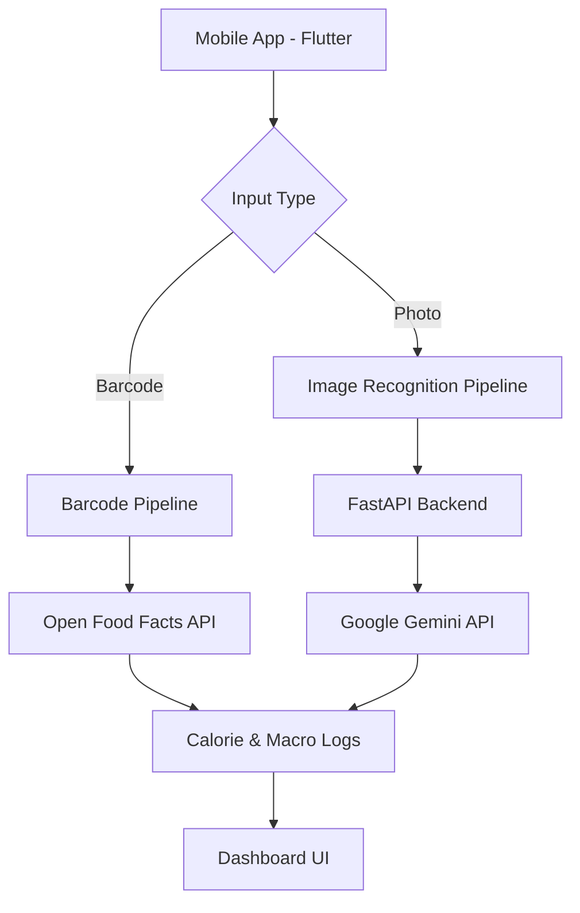

# 🚀 NutriScan: Hybrid AI Nutrition Manager

[](https://flutter.dev)
[](https://fastapi.tiangolo.com)
[](https://ai.google.dev/)
[](https://developers.google.com/ml-kit)

NutriScan is a next-generation mobile fitness and nutrition application that eliminates the friction of manual food logging. Built for performance and accuracy, it uses a **Hybrid AI Architecture** to provide real-time calorie and macro estimates.

---

## 🧠 The Hybrid AI Brain

NutriScan doesn't just scan; it *reasons*. Our multi-stage pipeline handles everything from packaged goods to complex prepared meals.

### 🔬 Core Algorithms
1.  **Input-Type Detection**: Smart switching between barcode and image recognition.
2.  **Barcode Recognition**: Fast decoding via **MLKit** + **Open Food Facts API** for precision global product lookups.
3.  **Image Recognition**: Powered by **Google Gemini 1.5 Flash**, providing vision-based reasoning for meals without barcodes.
4.  **Feedback Loop**: Learns from user corrections to improve future classification accuracy.

---

## 🛠️ Architecture Overview



---

## ✨ Features

-   📸 **Intelligent Scanning**: Seamlessly toggle between barcode and camera capture.
-   🔥 **Real-time Stats**: Instant breakdown of Calories, Protein, Carbs, and Fats.
-   💡 **AI Explanations**: Gemini provides natural language reasoning for its nutritional estimates.
-   📊 **History & Trends**: Track your nutrition over time with a clean, Material 3 interface.
-   🌙 **Premium UI**: Modern dark mode support and smooth micro-animations.

---

## 🚀 Installation & Setup

### ⚡ Backend (Python 3.10+)
1.  **Clone & Navigate**:
    ```bash
    cd backend
    ```
2.  **Virtual Env**:
    ```bash
    python -m venv venv
    source venv/bin/activate
    ```
3.  **Dependencies**:
    ```bash
    pip install -r requirements.txt
    ```
4.  **Environment Variables**:
    Create a `.env` file:
    ```env
    GEMINI_API_KEY=your_key_here
    ```
5.  **Run**:
    ```bash
    python main.py
    ```

### 📱 Frontend (Flutter)
1.  **Get Packages**:
    ```bash
    flutter pub get
    ```
2.  **Configure API**:
    Update the `BACKEND_URL` in `lib/providers/food_provider.dart` if testing on a physical device.
3.  **Launch**:
    ```bash
    flutter run
    ```

---

## 🧪 Technology Stack

-   **Frontend**: Flutter (Dart)
-   **Backend**: FastAPI (Python)
-   **Vision AI**: Google Gemini 1.5 Flash
-   **Scanning**: Google ML Kit Barcode Scanning
-   **Database**: Firebase Firestore (Recommended)
-   **API Data**: Open Food Facts

---

## 📜 License & Thesis
Developed as a high-fidelity prototype for NutriScan Mobile App thesis. 
Designed for scalability, performance, and ISO/IEC 25010 compliance.
